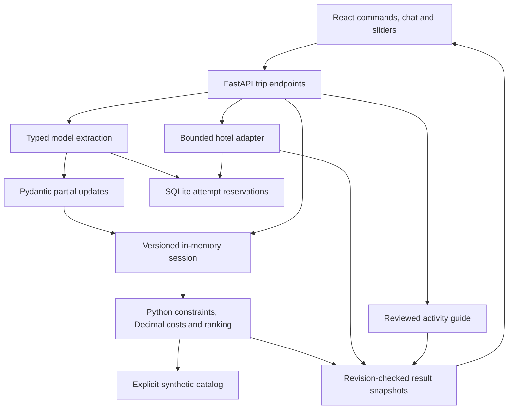

# Implementation architecture

This describes shipped code; product planning remains in the vault.

`contracts.py` defines preferences, decimal money, evidence and result schemas.
Partial changes merge only supplied fields; `sessions.py` publishes under revision
checks. Preference and conversation revisions reject late results, including when
a slider changes during a model/provider request.

`chat.py` requests bounded typed operations supported by quotes from the latest
message. The application validates operations and constructs replies. Ambiguous
output preserves preferences and asks focused questions. Quote matching does not
prove semantic correctness: real-model evaluation remains necessary. Retrieved
source prose cannot enter extraction as assistant instructions.

`planning.py` filters hard constraints before ranking independent adventure,
savings and transit priorities. Dorms, camping and overnight transport require
explicit acceptance. Costs retain quantity, party and coverage basis. Missing
required costs prevent a complete-budget claim. Hotel leads are not ranked as
whole trips because other costs and room requirements are unknown.

`trips_api.py` combines sources without conflating evidence. Hotel failure can leave
activities usable; old hotels stay marked unrefreshed. Model errors save nothing;
downstream hotel errors preserve validated preferences. `freshness.py` measures
source age, not snapshot age.

`usage.py` reserves lifetime attempts before network I/O. Errors count. Model
adapters share a bucket; hotels use another. No automatic retries, pagination or
autonomous tool loop exists. See [operating limits](reliability.md).

UI drafts save on slider release; refresh is explicit. A local age check updates
warnings without provider requests. The browser stores the session ID; the server
keeps the latest 20 messages in memory. SQLite contains counts, not traveler data.

A small explicit workflow makes control flow inspectable. Ephemeral sessions keep
the local demo simple but preclude multi-worker hosting. Authentication, shared
durable sessions and broader source coverage remain future work.
